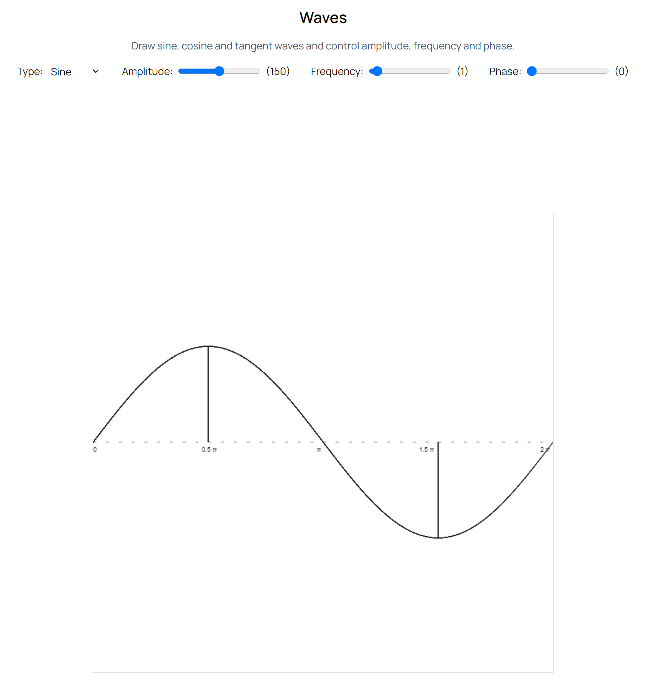

Waves
=====

Author: **[Afaan Bilal](https://afaan.dev)**

## Introduction
**Waves** is a experimental mathematical wave simulator written in Vue and Typescript with Canvas and Tailwind.

Try it here: **[waves.afaan.dev](https://waves.afaan.dev/)**

---

### Screenshots

---

### Features
- [X] Sine waves
- [X] Cosine waves
- [X] Tangent waves
- [X] Amplitude control
- [X] Frequency control
- [X] Phase control

## Contributing
All contributions are welcome. Please create an issue first for any feature request
or bug. Then fork the repository, create a branch and make any changes to fix the bug
or add the feature and create a pull request. That's it!
Thanks!

---

## License
**Lumina** is released under the MIT License.
Check out the full license [here](LICENSE).
